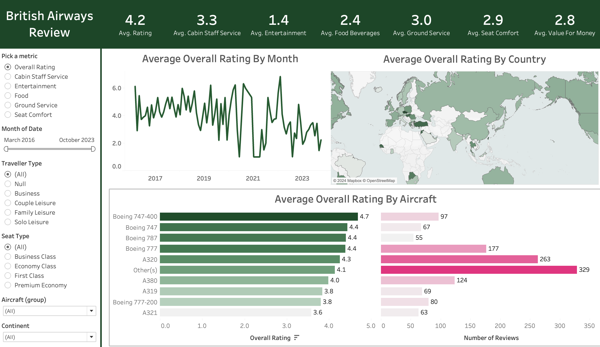

# British Airways Tableau Dashboard

A dynamic and interactive dashboard for visualizing British Airways reviews data. Users will have the flexibility to explore various metrics, filter by different criteria, and gain insights through interactive visualizations.

## Components

- **Dataset Connection**: Connecting to the British Airways reviews dataset, consisting of reviews with various metrics.
- **Data Preparation**: Mapping countries, setting up relationships, and preparing the dataset for visualization.
- **Dashboard Creation**: Building the interactive dashboard using Tableau.
- **Filter Implementation**: Creating filters for metrics, dates, seat types, traveler types, aircraft, and continents.
- **Visualizations**: Building visualizations including a map, summary metrics, monthly metrics, and metrics by aircraft.
- **Dashboard Finalization**: Final adjustments, tooltips, testing interactivity, and publishing to Tableau Public.

## Dashboard View

## Link to Tableau Public Dashboard
[Click Here!](https://public.tableau.com/shared/DS9JGBTYP?:display_count=n&:origin=viz_share_link)